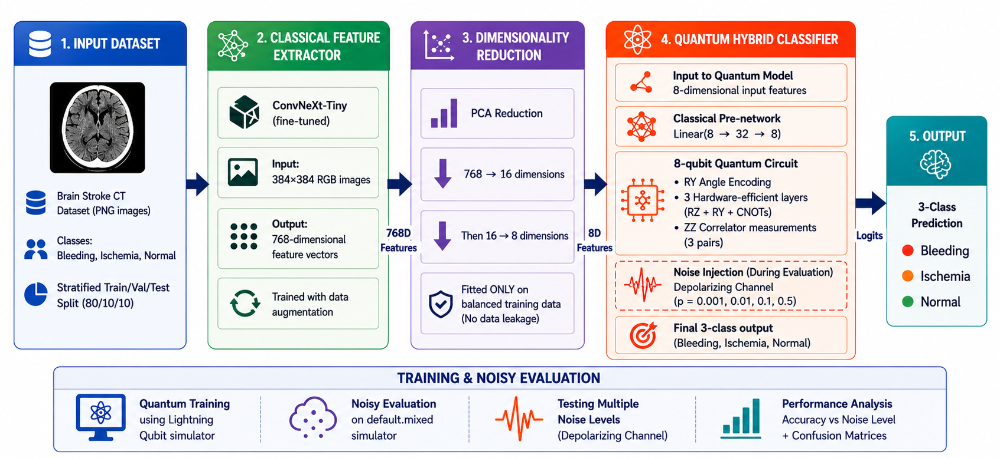
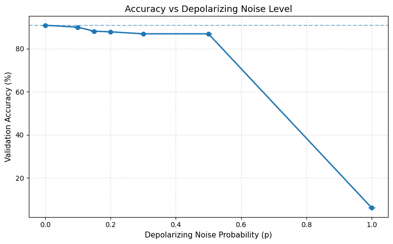
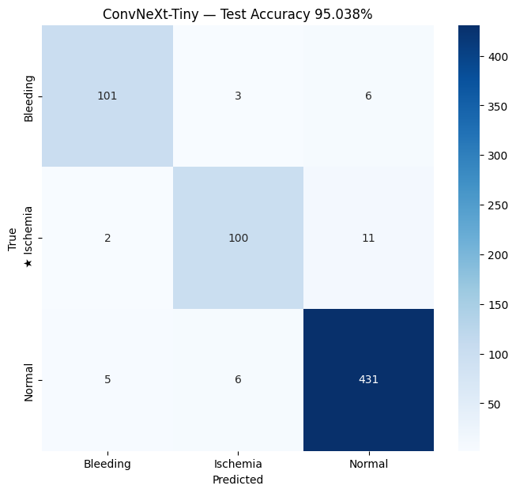
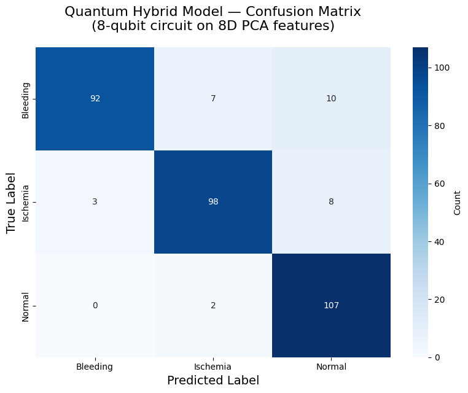
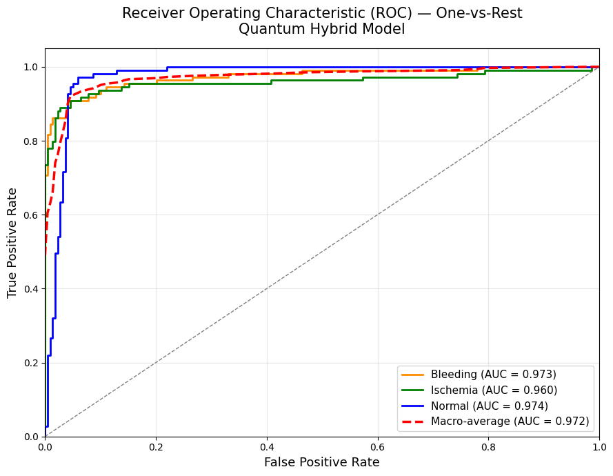

# 🔬 Hybrid QML Noise Analysis

A **Hybrid Quantum-Classical Machine Learning (QML)** project to study the effect of **quantum noise** on model performance using **8-qubit variational circuits**.

---

## 🚀 Project Objective

This project focuses on:

* Introducing **depolarizing noise** into a quantum circuit
* Observing how **noise impacts QML model accuracy**
* Analyzing **robustness of hybrid quantum models**

> ⚠️ This project is about **QML behavior under noise**, not the dataset itself.

---

## 🧠 Architecture Overview



---

## ⚙️ Pipeline

```
Input Images → ConvNeXt Feature Extraction → PCA (16 → 8)
→ Classical Neural Layer → Quantum Circuit (8 Qubits)
→ Measurement → Output
```

---

## 🔬 Quantum Setup

* **Framework:** PennyLane
* **Qubits:** 8
* **Encoding:** Angle Encoding
* **Layers:** Variational + Entanglement (CNOT)
* **Noise Type:** Depolarizing Channel
* **Device:** `default.mixed` (density matrix simulation)

---

## 📊 Results — Noise vs Accuracy



### 📈 Summary Table

| Noise (p) | Accuracy (%) | Drop (%) |
| --------- | ------------ | -------- |
| 0.00      | 90.83        | 0.00     |
| 0.10      | 89.91        | 0.92     |
| 0.15      | 88.07        | 2.75     |
| 0.20      | 87.77        | 3.06     |
| 0.30      | 86.85        | 3.98     |
| 0.50      | 86.85        | 3.98     |
| 1.00      | 6.12         | 84.71    |

---

## 📌 Key Observations

* Model shows **strong robustness up to p = 0.3**
* Accuracy degradation is **gradual under moderate noise**
* At extreme noise (**p = 1.0**), performance collapses
* Zero variance due to **analytic simulation (deterministic results)**

---

## 📊 Model Performance

### 🔹 Classical Model (ConvNeXt)



### 🔹 Quantum Model



### 🔹 ROC Curve



---

## 📂 Repository Structure

```
Hybrid-QML-Noise-Analysis/
│── Hybrid-QML-Noise-Analysis.ipynb
│── README.md
│── noisy_qml_block_diagram.png
│── noisy_accuracy.png
│── cnn_confusion_matrix.png
│── qml_confusion_matrix.png
│── qml_roc_curve.png
```

---

## 🛠️ Tech Stack

* Python
* PyTorch
* PennyLane
* ConvNeXt (timm)
* Scikit-learn
* Matplotlib / Seaborn

---

## ▶️ How to Run

1. Open notebook in Google Colab
2. Install dependencies
3. Run all cells sequentially
4. Observe noise impact in **Cell 4 & 5**

---

## 📌 Future Work

* Real quantum hardware testing (IBM / IonQ)
* Different noise models (Amplitude damping, Phase flip)
* Larger qubit systems
* Noise mitigation techniques

---

## ⭐ Conclusion

This project demonstrates that:

* Hybrid QML models can be **noise-resilient**
* Performance degradation is **controlled under realistic noise**
* Extreme noise leads to **complete information loss**

---

## 👨‍💻 Author

**Murali**
🔗 https://github.com/kantemurali

---
MIT License

Copyright (c) 2026 kantemurali

Permission is hereby granted, free of charge, to any person obtaining a copy
of this software and associated documentation files (the "Software"), to deal
in the Software without restriction, including without limitation the rights
to use, copy, modify, merge, publish, distribute, sublicense, and/or sell
copies of the Software, and to permit persons to do so, subject to the
following conditions:

The above copyright notice and this permission notice shall be included in all
copies or substantial portions of the Software.

THE SOFTWARE IS PROVIDED "AS IS", WITHOUT WARRANTY OF ANY KIND, EXPRESS OR
IMPLIED, INCLUDING BUT NOT LIMITED TO THE WARRANTIES OF MERCHANTABILITY,
FITNESS FOR A PARTICULAR PURPOSE AND NONINFRINGEMENT. IN NO EVENT SHALL THE
AUTHORS OR COPYRIGHT HOLDERS BE LIABLE FOR ANY CLAIM, DAMAGES OR OTHER
LIABILITY, WHETHER IN AN ACTION OF CONTRACT, TORT OR OTHERWISE, ARISING FROM,
OUT OF OR IN CONNECTION WITH THE SOFTWARE OR THE USE OR OTHER DEALINGS IN THE
SOFTWARE.

